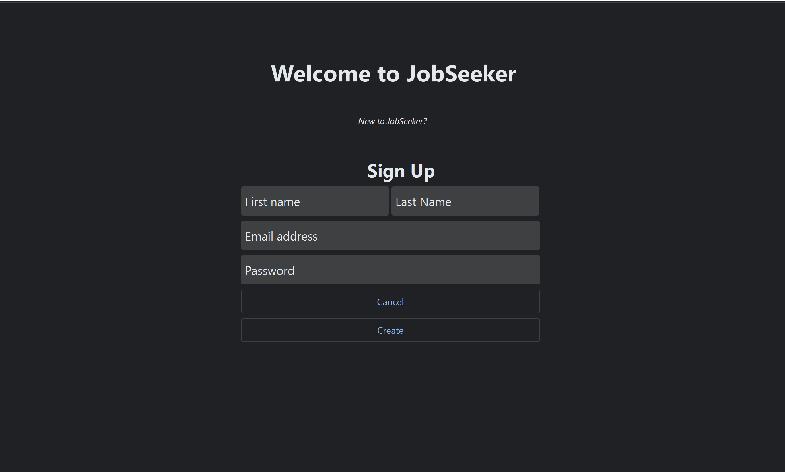

# Overview

Team Rayquaza consists of David Leavenworth, Sean Higley, Shan Rafique, and Jesus Torres. With the help of our customer, Benjamin Vu, we developed and application in Python named JobSeeker. JobSeeker allows the user to sign up, or log in with an existing account, to search for a new job in a large database holding hundreds of positions. The user can filter out positions they seek and would wish to apply for. With these options, a user can find their dream position in their selected location and preferred salary. There will be no need for the user to upload a resume for each position they apply to. For the user who wishes to apply to more than one job, they have the freedom to quickly apply to as many positions as they desire.

# Implementations
## Signup/Login

  
 
 

  
 
JobSeeker allows a returning user to login into their account and access the many jobs the application has to offer. When a user attempts to sign in with a non-existent account or with invalid credentials, then the user will not be allowed access. If the user is new, then they can sign up and create a new account that will be saved in our database. 

## Filters
###### Position:
 

  
 
For job seekers who want to narrow down the search results for their dream job, we have added a filter to populate the results to your specifications. No need to search through a list of positions that you are not interested in. With suggested searches, we will recommend search options for a job we believe the user is interested in.
  
###### Location:
 

  
  
For users who want to work near home, or far away from home, we added a filter for locations when searching for jobs. Compared to the position filter, the location filter works very similarly. With suggested searches, we will recommend search options for a location we believe the user is interested in. 
  
###### Salary Range: 

  
 
One of the most important factors when searching for a job is the salary offered for the position. For the user who wants to seek a preferred salary, they can filter out jobs that don't fit their criteria. No need to search for a job that will not pay the salary you seek. With hundreds of jobs in our database, we have filters ranging from $0-100,000+. Jobs ranging over $100,000 reach a salary of $20,000,000+.
 
## Job Listings
###### Selection:
###### Paganation:

## Quick Apply

## Profile

## Database 

# Documents  

Technical debt assignment found [here](https://github.com/comp129/customer-project-rayquaza/blob/main/docs/techDebt.md)

Customer Notes found [here](https://github.com/comp129/customer-project-rayquaza/blob/main/CustomerNotes.md)

Sprint specific information found [here](https://github.com/comp129/customer-project-rayquaza/blob/main/docs/Sprints.md)

Traditional report found [here](https://github.com/comp129/customer-project-rayquaza/blob/main/docs/report.md)
 
# Customer interaction with the application
1. Not deployable as of right now
2. Will host DB on the cloud (24/7 access from the cloud rather than our local host)
3. Will interact through an executable
    - For Windows, it be packaged as a .exe file
    - For Macs, it will be packaged as a .app file
    - For Linux, it will be packaged as a Linux distribution

# Software needed to run the application
1. Install [Python 3.10](https://www.python.org/downloads/release/python-3104/)
2. Install [Pipenv](https://pypi.org/project/pipenv/) via ``pip install pipenv``
3. [PySide6](https://pypi.org/project/PySide6/) 
4. [PyMongo](https://pypi.org/project/pymongo/)
5. [Certifi](https://pypi.org/project/certifi/)

Packages 3-5 can be installed by running ``pipenv shell && pipenv install`` from a CLI when in the root directory of this project.
