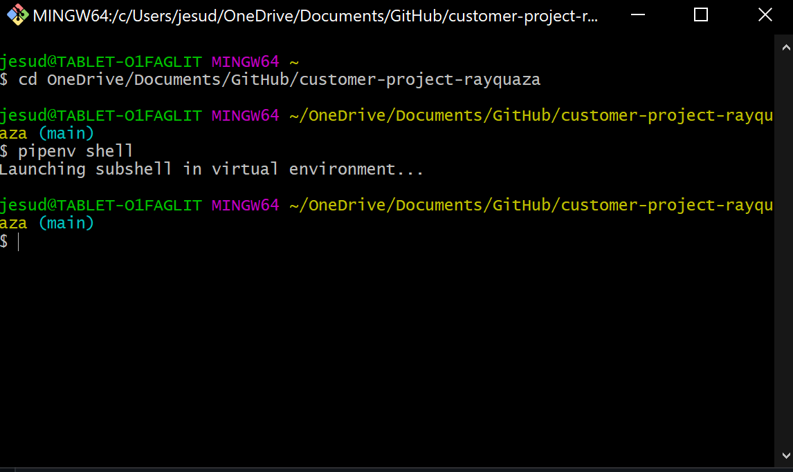

Github Actions Integration

Pytests Action Integration

Test Fail:

Test Pass:

--- CURRENT DEPENDENCIES / IMPORTS ---

Ship:

- [X] Python – latest version 3.10

- [X] Pyside6 – GUI

Dev:

- [X] PyTest - Unit testing for python

- [X] Virtual Environment – pipenv

- [X] [PyMongo](https://www.mongodb.com/docs/drivers/python/) - Mongo DB driver for python application

--- ADDITIONAL TOOLS / PROCESSES / ENGINEERING PRACTICES  ---

Additional Tools: 

- [X] Visual Studio  
- [X] Mongo DB
- [x] [Mongo DB Compass](https://www.mongodb.com/products/compass) - Viewing the DB
- [x] [Qt Creator](https://www.qt.io/offline-installers) - Widget toolkit for creating GUIs in Pyside6

Engineering practices:
- [X] Scrum - framework 

- [x] Design in an OOP paradigm 

- [x] Camel case naming for variables and functions, pascal case for classes

--- CONFIGURED MACHINES  ---

Jesus Torres:

Sean Higley:

David Leavenworth:

Shan Rafique:

